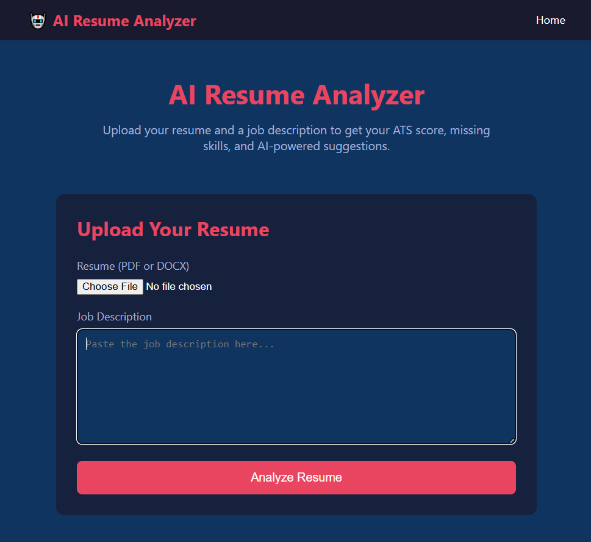
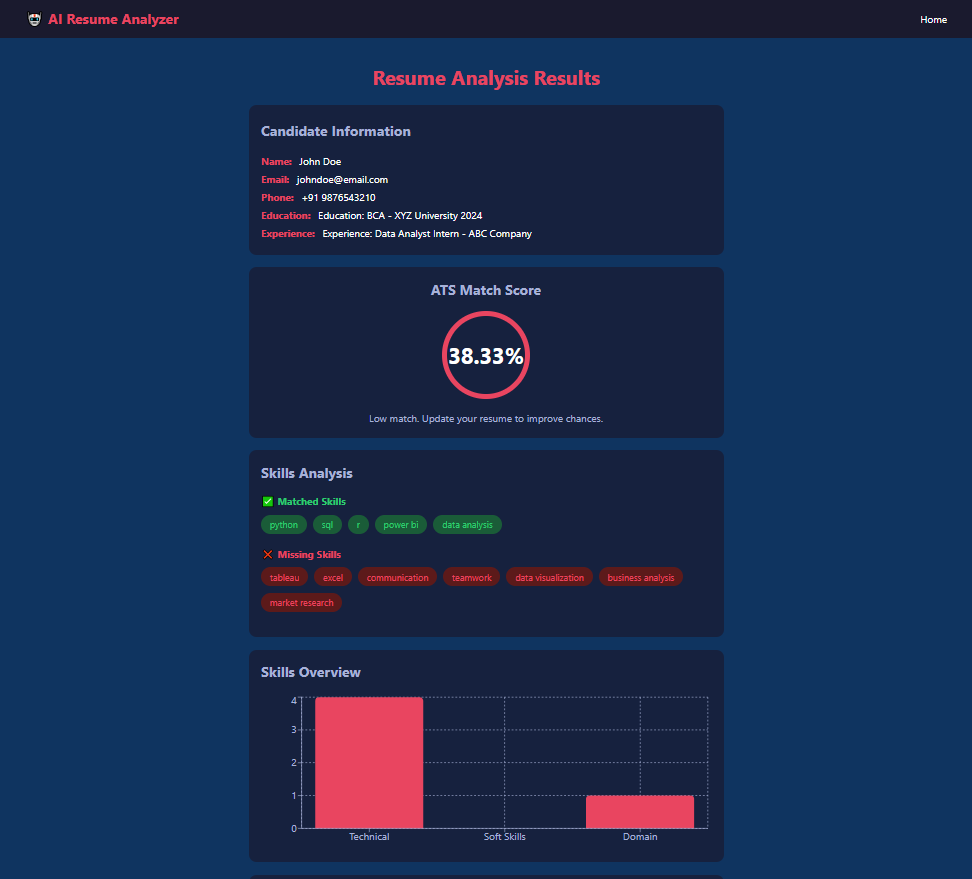
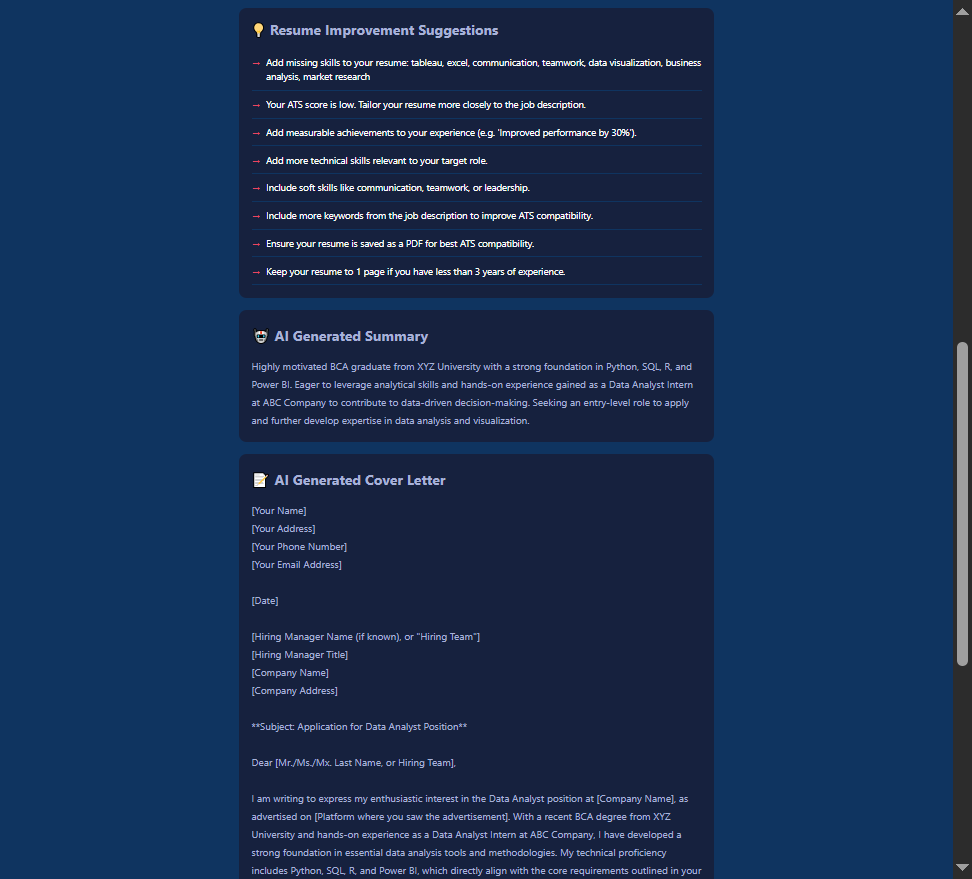
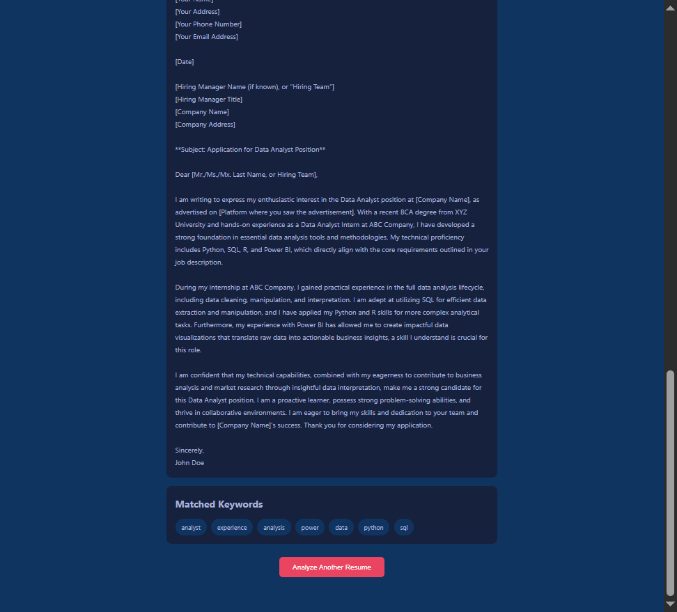

# 🤖 AI Resume Analyzer

A full-stack AI-powered web application that analyzes resumes against job descriptions, calculates ATS compatibility scores, identifies skill gaps, and generates professional summaries and cover letters using Google Gemini AI.

---

## 📌 Project Overview

This project simulates a real-world HR and recruitment scenario where candidates need to understand how well their resume matches a job description before applying.

The goal was to build a complete resume analysis tool — from file upload and text extraction, through NLP-based skill matching and ATS scoring, to AI-generated summaries and cover letters — that demonstrates the core skills expected for **Data Analyst**, **Business Analyst**, and **Technology Analyst** roles.

---

## 🎯 Problem Statement

Job seekers often apply to roles without knowing:
- How well does my resume match this job description?
- Which skills am I missing for this role?
- What keywords should I include to pass ATS filters?
- How can I improve my resume to increase my chances?
- Can AI help me write a professional summary and cover letter?

This application answers all of these questions.

---

## 🛠 Tech Stack

| Layer | Technology | Purpose |
|-------|-----------|---------|
| Frontend | React.js (Vite) | User interface and results dashboard |
| Backend | Python Flask | REST API and business logic |
| NLP | spaCy | Named entity recognition and text processing |
| Parsing | pdfplumber, python-docx | PDF and DOCX resume extraction |
| AI | Google Gemini API | Summary and cover letter generation |
| Database | MongoDB Atlas | Cloud storage for analysis history |
| Charts | Recharts | Skills visualization |
| Deployment | Vercel + Render | Frontend and backend hosting |

---

## 📂 Project Structure

```
AI-Resume-Analyzer/
│
├── frontend/                        # React.js frontend (Vite)
│   └── src/
│       ├── components/
│       │   ├── Navbar.jsx           # Navigation bar
│       │   ├── UploadForm.jsx       # Resume upload and JD input form
│       │   ├── AtsScore.jsx         # ATS score circle display
│       │   ├── MissingSkills.jsx    # Matched and missing skills
│       │   ├── SkillsChart.jsx      # Bar chart for skills breakdown
│       │   └── Suggestions.jsx      # Resume improvement suggestions
│       └── pages/
│           ├── Home.jsx             # Landing page
│           └── Results.jsx          # Full analysis results dashboard
│
├── backend/                         # Python Flask backend
│   ├── resume_parser/
│   │   ├── parser.py                # PDF and DOCX text extraction
│   │   ├── matcher.py               # ATS score and skill matching logic
│   │   ├── suggestions.py           # Rule-based improvement suggestions
│   │   └── skills_list.json         # Curated skills dictionary
│   ├── ai_model/
│   │   └── gemini.py                # Google Gemini API integration
│   ├── database.py                  # MongoDB Atlas connection
│   ├── app.py                       # Main Flask application and API routes
│   └── requirements.txt             # Python dependencies
│
└── screenshots/                     # App screenshots
```

---

## 🎯 Core Features

| Feature | Description |
|---------|-------------|
| 📄 Resume Upload | Upload PDF or DOCX resume files |
| 🔍 Information Extraction | Extracts name, email, phone, skills, education, and experience using NLP |
| 📊 ATS Score Calculator | Calculates weighted match percentage between resume and job description |
| ✅ Skill Matching | Side-by-side view of matched and missing skills |
| 🔑 Keyword Analysis | Identifies important keywords present and missing from the resume |
| 💡 Improvement Suggestions | Rule-based tips tailored to the specific resume and job description |
| 📈 Skills Visualization | Bar chart breaking down technical, soft, and domain skills |
| 🤖 AI Summary Generator | Google Gemini generates a professional resume summary |
| 📝 Cover Letter Generator | Google Gemini generates a tailored cover letter for the role |
| 💾 Analysis History | MongoDB Atlas stores every analysis for future reference |

---

## 🔌 API Endpoints

| Method | Endpoint | Description |
|--------|----------|-------------|
| GET | /health | Check if backend is running |
| POST | /upload | Upload and parse a resume file |
| POST | /match | Calculate ATS score and generate AI content |
| GET | /history | Retrieve all past analyses |

---

## 📸 Screenshots

### Home Page — Resume Upload


### Results — Candidate Info, ATS Score & Skills Analysis


### Results — Suggestions & AI Generated Summary


### Results — AI Cover Letter & Matched Keywords


---

## 🚀 Getting Started Locally

### Prerequisites
- Python 3.10+
- Node.js 18+
- MongoDB Atlas account
- Google Gemini API key

### 1. Clone the repository

```bash
git clone https://github.com/ANKAN-22/AI-Resume-Analyzer.git
cd AI-Resume-Analyzer
```

### 2. Backend Setup

```bash
cd backend
python -m venv venv
venv\Scripts\activate
pip install -r requirements.txt
python -m spacy download en_core_web_sm
```

Create a `.env` file inside the `backend/` folder:

```
MONGO_URI=your_mongodb_atlas_connection_string
DB_NAME=resume_analyzer
GEMINI_API_KEY=your_google_gemini_api_key
```

Start the backend server:

```bash
python app.py
```

### 3. Frontend Setup

```bash
cd frontend
npm install
npm run dev
```

Open your browser at the local development URL shown in the terminal.

---

## 🌐 Live Demo

- **Frontend:** https://ai-resume-analyzer.vercel.app
- **Backend API:** https://ai-resume-analyzer-api.onrender.com

---

## 🎤 Project Summary

This project demonstrates a complete AI-powered resume analysis pipeline — from file upload and NLP-based text extraction, through ATS scoring and skill gap analysis, to AI-generated professional summaries and cover letters using Google Gemini API. Built with a React.js frontend, Python Flask backend, and MongoDB Atlas for persistent storage.

---

## ⭐ Skills Demonstrated

`Python` `Flask` `React.js` `REST API` `NLP` `spaCy` `Resume Parsing` `Google Gemini API` `AI Integration` `MongoDB Atlas` `Data Visualization` `Full-Stack Development` `Git & GitHub`

---

*Built as a portfolio project to demonstrate full-stack and AI integration skills for internship and entry-level roles.*